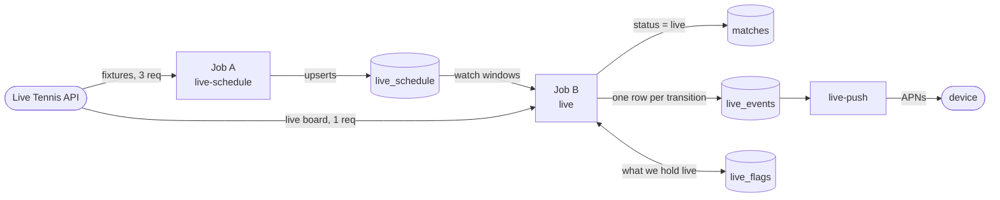
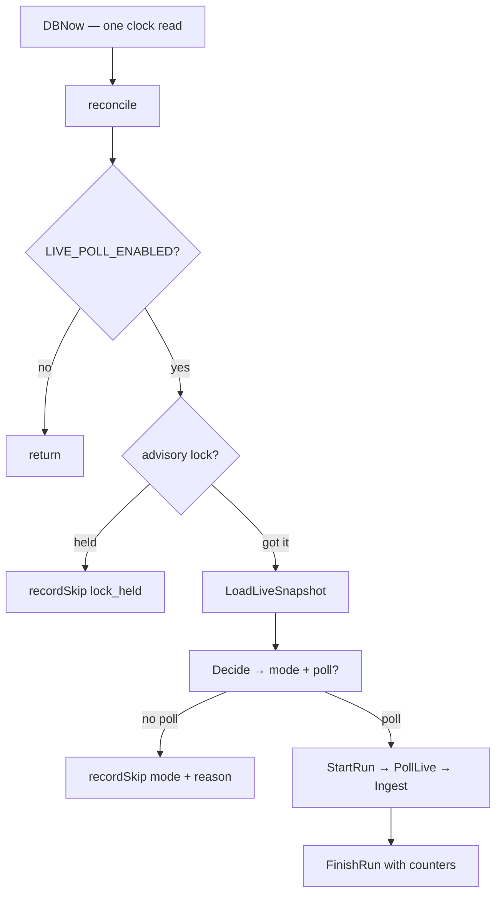
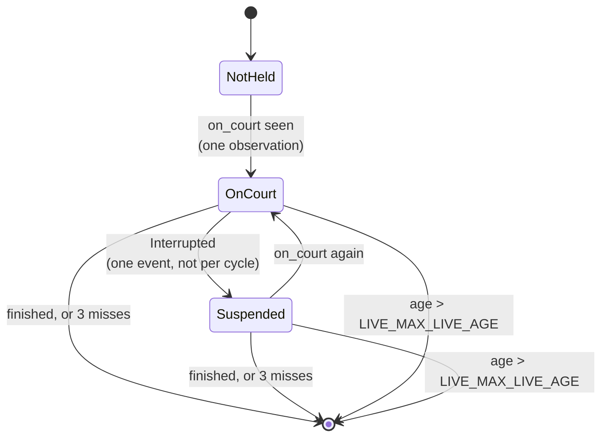

# How live match status actually flows

What the feature does, in one sentence: **when the vendor says a followed player is on court, one
column changes — `matches.status` → `live` — and every consequence follows from that column.**

The card on the lock screen, `is_live` in the widget, `/v1/users/me/live-matches` and the APNs push
all read or react to that single write. Nothing else about a match is ever written by this service.

This file traces the path through the code. For *why* the design is shaped this way see
[`live-status-ingest.md`](live-status-ingest.md); for who owns which table see
[`database.md`](database.md).

---

## The moving parts

Three cron jobs, registered in `cmd/server/main.go`:

| Job | Cron (default) | Costs | What it answers |
|---|---|---|---|
| `live-schedule` (Job A) | `0 */8 * * *` | 4 requests/run | *When do our players play?* |
| `live` (Job B) | `*/5 * * * *` | 0–1 requests/tick | *Is anyone on court right now?* |
| `live-push` | `* * * * *` | 0 | *Does anyone need a push?* |

A cron tick is free; a vendor request is not — 100/day on the free tier. That asymmetry is the whole
reason Job B ticks twelve times an hour and usually spends nothing.



## Boot

`cmd/server/main.go` → `config.Load()` → pool → **`storage.ApplyLiveSchema`** (embedded `db/live_*.sql`,
idempotent, under an advisory lock) → jobs registered → HTTP server. A schema failure is logged, not
fatal: it breaks the live feature only.

---

## Job A — `live-schedule`

`internal/updater/live/schedule.go`. Learns when our players play, so Job B can spend requests only
in those hours.

1. `cfg.Enabled` — off → return, nothing spent.
2. `SweepAbandonedRuns` — closes runs a SIGKILL left with `finished_at is null`, because STALE-SAFE
   reads "last successful run".
3. `AcquireLiveLock(LiveLockSchedule)` — `pg_try_advisory_lock` on a dedicated connection. Not
   acquired → `recordSkip('lock_held')` and return.
4. `TrackedExternalKeys` — the vendor's ids for our tracked players (101 today). Empty → warn and
   return: the seeds were never applied.
5. `StartRun` — opens the run row and returns `started_at`. **This is the cycle's only clock read**,
   and it comes from Postgres.
6. `src.Fixtures(keys)` — batches of 50 (the `player=` filter's documented maximum), so 101 players
   cost **3 requests**. Each attempt increments `requests_made` before the call.
7. Filter and dedupe: drop fixtures with no tracked player (counted as `foreign`), then dedupe by
   `external_key` — the vendor returns a match in *every* batch containing either of its players, so
   a match between two tracked players arrives twice.
8. `UpsertSchedule` — upsert plus GC in **one transaction**. Never delete-then-insert: a half-fetched
   schedule would put Job B to sleep for eight hours with no error anywhere.
9. If `LIVE_CREATE_MATCHES` → `createMatches` (see below). Off by default.
10. `PruneLiveTables` — retention: observations 30d, runs 14d, consumed events 7d, unmatched 90d.
    Unconsumed events are never touched.
11. `reconcileQuota` — `GET /usage`, comparing our arithmetic against the vendor's own count. Our day
    boundary is UTC by assumption; if theirs differs the governor is wrong for part of every day.
12. `FinishRun` — on a context detached from the cycle timeout, so a timeout can't lose the row.

**A partial fetch commits what it got and still marks the run `error`.** Data and status diverge on
purpose: an extra fixture only widens a watch window (safe), while an empty schedule is silent
darkness (not).

### `createMatches` — off by default

Only place this service *adds* rows rather than changing one column. Every guard is required:

qualifying skipped → start time known → tournament resolves to a **confirmed** edition mapping →
both players resolve → `round_code` exists in `rounds` (it's a foreign key, and the vendor's
vocabulary is not a subset of ours) → no existing match for that pair in that edition → insert match
plus both participants in one transaction, stamped `import_key = 'livetennisapi:<id>'`.

Unmapped tournament → `live_unmatched(reason='edition_unmapped')`, which is the queue that grows
`db/live_edition_ids.sql`. Created rows get `prior_status='cancelled'` at flip time, so when they end
they land on a terminal status instead of reappearing as someone's next match; anything still
`scheduled` 48h past its start is cancelled by the reaper.

---

## Job B — `live`

`internal/updater/live/poll.go`. The order of the first two steps is the important part.



**1. `reconcile` runs before the enabled check.** Deliberately: everything in it *takes a card down*,
and all of it must work when polling is off — quota exhausted, vendor down, kill switch pulled.

- `OrphanFlags` → a flag whose match is no longer `live` (the pipeline took the row) → `FlipOut`
- `UnflaggedLiveMatches` → a match `live` with no flag of ours → **logged loudly, never adopted**;
  restoring a `prior_status` we never recorded would be a guess
- `RetireCreatedMatches` → our own stale `scheduled` rows → `cancelled`
- `StaleFlags` → anything held live longer than `LIVE_MAX_LIVE_AGE` (6h) → forced out

**2. Then** the enabled check, the janitor, and `pg_try_advisory_lock(LiveLockPoll)`.

**3. `LoadLiveSnapshot`** — one query returning everything the decision needs: active flag count,
watch windows from `live_schedule` (± lead/tail), today's request spend across *both* jobs, spend in
STALE-SAFE mode, last poll, last successful Job A run.

**4. `Decide`** — pure function, `now` as a parameter, no DB and no clock (`decide.go`).

| Mode | Condition (first match wins) | Then |
|---|---|---|
| `active` | we hold at least one flag | poll — the only way to learn it ended |
| `watching` | now inside a `live_schedule` window | poll |
| `stale_safe` | no successful Job A run in 12h | poll, own interval, own daily cap — **fail open** |
| `asleep` | none of the above | return, spend nothing — most ticks |

Then the governor:

```
left       = LIVE_DAILY_QUOTA − spent_today − LIVE_RESERVE
if left < 2 (maxPagesPerRun) → refuse: skipped_reason='quota_exhausted', no HTTP call
horizon    = min(end of UTC quota day, now + LIVE_WATCH_TAIL)
watch_mins = union (not sum) of windows in [now, horizon]
need       = clamp(watch_mins / left, LIVE_MIN_INTERVAL, LIVE_MAX_INTERVAL)
poll if now − last_poll ≥ need − 30s (tickSlack)
```

Five details that each hide a silent failure: the refusal is a hard gate, not `max(left,1)`; windows
are **unioned** because ten fixtures at 15:00 sum to ~3900 minutes and union to ~400; the horizon is
truncated at the quota day so a 23:50 tick doesn't divide tomorrow's minutes by today's requests;
`tickSlack` stops a poll finishing at `:00:03` from doubling the effective floor; and STALE-SAFE gets
`LIVE_STALE_INTERVAL` plus `LIVE_STALE_DAILY_CAP` instead of the floor, which at 5 minutes would be
288 requests against a budget of 100.

**Every tick writes a run row with its `mode`**, poll or skip. That table is the only window into why
a card did or did not appear.

**5. `PollLive`** → parse (`internal/livesource`) → `Ingest`.

### `Ingest` — one pass over the board

1. **Zero-rows guard.** `rows_parsed == 0` means the API broke, not that tennis stopped: record the
   error, write no observations, **sweep nothing**.
2. **Collapse guard.** If the previous successful run had ≥3 of our matches in scope and this one has
   less than half, refuse to sweep. Below 3 the signals are genuinely identical — holding one card,
   `1 → 0` looks the same whether the match ended or the vendor stopped listing it, and there the
   three-miss debounce is the protection.
3. `HeldLiveFlags` — what we currently hold, with each flag's miss count computed as *qualifying runs
   since `last_seen_run_id`*. Runs are totally ordered, so "three consecutive" is exact rather than a
   heuristic over timestamps — and the predicate for "this run counts as an absence" is the same as
   "the guard did not fire", so guard and debounce cannot disagree.
4. `ResolvePlayerKeys` — one batched lookup for every player id on the board.
5. Per observation:
   - **neither player ours** → dropped silently, counted in `rows_dropped_unresolved`. The board is
     ATP, WTA, Challenger and ITF worldwide; queueing these would put hundreds a cycle into a table
     that is supposed to be a review queue.
   - **one ours** → `live_unmatched('one_side_unresolved')`, and the lazy resolver may spend one
     request on `GET /players/{id}` — capped per cycle, negatively cached with growing backoff, and
     matched on name alone because `birth_date` and `country_code` are NULL for all players.
   - **both ours** → `FindMatchByPlayers`.
6. `AppendObservation` with `run_id`, then `Derive`, then `applyAction`.
7. **Absence sweep**, only after a successful poll: every held flag not seen this cycle gets a miss.
   Flags with `source='dev'` are exempt — a hand-flipped match can never appear on the vendor's board
   and would otherwise revert mid-test.

### `FindMatchByPlayers` — the identity of a match

```sql
where m.status in ('scheduled','live')
  and m.discipline = 'singles'
  and m.scheduled_at between (fixture time − LIVE_MATCH_WINDOW) and (+ LIVE_MATCH_WINDOW)
  and exists (participant = player A) and exists (participant = player B)
  and (count of participants) = 2
limit 2
```

Not keyed on `round_code` (our vocabulary differs between editions — `R128/R64` in one, `R1/R2` in
another for the same draw) and not on the tournament (the pair plus the window is already
near-unique). `limit 2` so more than one hit is **refused**, not guessed:
`live_unmatched('ambiguous')`. No hit at all: `live_unmatched('no_match_row')`. A NULL `scheduled_at`
never matches, because `between` on NULL is NULL.

---

## `Derive` — the debounce

`internal/updater/live/derive.go`. Pure function: current flag state plus this cycle's signal in,
new state plus an action out. The asymmetry between entry and exit is the heart of the feature.



**In on a single `on_court` observation.** Cheap entry is only safe because the parser refuses to
guess: an unrecognised `event_status` drops the row entirely rather than falling back to on-court, so
"we see on_court" is the vendor's assertion, not our inference.

**Out on an explicit finish, or three consecutive misses, or maximum age.** A card that lingers half
an hour costs nothing; a false LIVE is a push that cannot be recalled.

The age check runs **first**, so it works when polling isn't happening at all.

---

## The two guarded writes

`internal/storage/live.go`. Both do their `matches` update, their `live_flags` change and their
`live_events` insert in **one transaction** — otherwise a crash between them either loses a push or
sends one for a transition that never happened.

**`FlipLive`** — takes the `matches` row lock first, then:

```sql
-- only from scheduled, only without a winner
update matches set status = 'live' where id = $1 and status = 'scheduled' and winner_side is null
```

The vendor emits stale live rows (`status: "live"` beside `event_status: "Finished"`); without this
guard they would resurrect completed matches over results the pipeline owns. `prior_status` is
recorded now, because the exit has to restore it — and for our own created rows it is recorded as
`cancelled`, so they end terminally. Idempotent: already live → no write, and returns
`FlipAlreadyLive` rather than a bare `false`, so a refusal can be counted instead of vanishing.

**`FlipOut`** — same lock order, then:

```sql
update matches set status = prior_status where id = $1 and status = 'live'
```

If the pipeline took the row back, we leave it alone — **but still clear the flag and emit the
event**, or the card never goes out.

---

## The pusher

`internal/updater/live/push.go`, the only consumer of the outbox.

1. `DBNow`, then `sweepStale` — **before** the enabled check, force-ending sessions past
   `PUSH_MAX_SESSION_AGE`, because a feed outage mid-match produces no end event at all.
2. Enabled check, advisory lock.
3. `ClaimLiveEvents` — `for update skip locked`, `attempts < PUSH_MAX_ATTEMPTS`, and only rows whose
   last attempt is older than `PUSH_RETRY_AFTER`.
4. `live` → `pushStart`: audience is everyone following either player who has a token and no open
   session for this match. **The session slot is claimed before the push is sent** and released if the
   send fails — the partial unique index on `(user_id, match_id) where ended_at is null` is the only
   thing preventing a second start push, and sending first would let a crash leave a card with no
   session and therefore no way to end it.
5. `finished` → `pushEnd`: needs the *activity's own* token, which the client must have posted to
   `PUT /v1/users/me/live-activities/{match_id}`. Without it there is nothing to end the card with and
   iOS retires it hours later.
6. `suspended` / `resumed` → consumed with **no action**: no product decision exists for what the card
   should say during a rain delay.
7. A retryable failure returns the event to the queue; only success consumes it. 410 deletes the
   token; a 403 clears the cached JWT so the next attempt re-signs.

Payloads carry match identity and never a score.

---

## Endpoints

| Endpoint | Purpose |
|---|---|
| `GET /v1/users/me/live-matches` | launch reconciliation: what is live among your follows, no score fields at all, with `total` and `truncated` so absence from a cut list isn't read as "ended" |
| `PUT /v1/users/me/push-token` | the push-to-start token, `env` required and never guessed |
| `PUT /v1/users/me/live-activities/{match_id}` | the started activity's own token |
| `POST /v1/dev/matches/{id}/live` · `/finish` | hand triggers, idempotent, `409 not_flippable` if the row isn't a scheduled match without a winner |
| `POST /v1/dev/live/ingest` | replay a saved board through the real ingest path — **zero vendor quota** |
| `GET /v1/dev/live/unmatched` | the review queue |

`/v1/dev/*` exists only when `DEV_ENDPOINTS_ENABLED=true`; the routes are not registered otherwise.

## Tables

| Table | Holds |
|---|---|
| `live_ingest_runs` | one row per tick of any job, with `mode` and `skipped_reason` — the only window into why a card did or didn't appear |
| `live_observations` | append-only log of what the vendor said, keyed to a run |
| `live_flags` | which matches *we* hold live, what to restore, when we last saw each |
| `live_schedule` | our players' fixtures — a cache, and the source of watch windows |
| `live_unmatched` | review queue: `no_match_row`, `ambiguous`, `one_side_unresolved`, `edition_unmapped`, `round_unmapped` |
| `live_events` | outbox of transitions, with `attempts` and `claimed_at` |
| `live_resolve_attempts` | negative cache for the lazy resolver |
| `live_activity_sessions` | one open session per user per match |
| `external_ids` | vendor ids → our players and editions, N:1 |

## Invariants

Break any of these and the failure is quiet:

1. **No score data leaves this service.** Enforced by type — the wire struct has no score fields — plus
   a reflect test over field *names* and a marshal-and-grep test.
2. **`matches.status` is the only column written**, and every write is conditional on the current value.
3. **Absence counts only after a successful poll.** A failed cycle records nothing.
4. **Debounce state lives in Postgres**, not memory: Railway restarts on every deploy.
5. **Unrecognised vendor values are never guessed into on-court.**
6. **One clock read per cycle, from Postgres**, stamped into everything the cycle writes.

## When something looks wrong

| Symptom | Look at |
|---|---|
| no cards at all | `live_ingest_runs.mode` — stuck `asleep` means no windows; `live_schedule` empty means Job A hasn't run |
| `rows_matched = 0` while matches are live | `live_unmatched.reason` — `no_match_row` means our row has a NULL `scheduled_at` or ≠2 participants |
| a card that won't go away | `live_flags` — `flipped_at` older than `LIVE_MAX_LIVE_AGE` should be force-exited by `reconcile` |
| a match live that we never flipped | the `UnflaggedLiveMatches` warning — the content pipeline also sets `status='live'` from its own `isLive` |
| quota gone by midday | `select sum(requests_made) … group by mode` — `stale_safe` spending means Job A is failing |
| pushes not arriving | `live_events` where `consumed_at is null` and `attempts >= PUSH_MAX_ATTEMPTS`, plus `last_error` |
